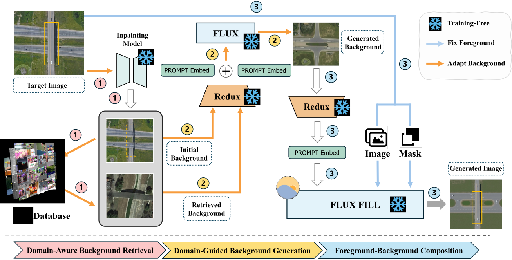

# Domain-RAG: Retrieval-Guided Compositional Image Generation for Cross-Domain Few-Shot Object Detection (NeurIPS 2025)

[🔥 Paper (NeurIPS 2025)](https://arxiv.org/abs/2506.05872) | [📦 Dataset Scripts](#dataset-preparation) | [🧠 Model Zoo](#pretrained-models) | [🚀 Quick Start](#quick-start) | [🎥 Video](#video) | [📊 Evaluation](#evaluation) | [📞 Contact](#contact)

---

**Domain-RAG** is a novel retrieval-augmented generative framework designed for **Cross-Domain Few-Shot Object Detection (CD-FSOD)**. We leverage large-scale vision-language models (GroundingDINO), a curated COCO-style retrieval corpus, and Flux-based background generation to synthesize diverse, domain-aware training data that enhances FSOD generalization under domain shift.

<p align="center">
  
</p>

---

## ✨ Highlights

- 🔍 **Retrieval-Augmented Generation**: retrieve semantically similar source images for novel-class prompts.
- 🎨 **Flux-Redux Integration**: compose diverse backgrounds with target foregrounds for domain-aligned generation.
- 📦 **Support for Multiple Target Domains**: DIOR, ArTAXOr, DeepFish, UODD, NEU-DET, and more.
- 🧪 **Strong Benchmarks**: surpasses GroundingDINO baseline in 1-shot and 5-shot CD-FSOD across 6 datasets.

---

## 🔧 Installation

```bash
git clone https://github.com/LiYu0524/Domain-RAG.git
cd Domain-RAG
conda create -n domainrag python=3.10
conda activate domainrag
pip install -r requirements.txt
```


## Pretrained Models

we will relase the fine-tuned grounding-dino model soon

## Dataset Preparation

You can prepare CDFSOD with [CDVITO](https://github.com/lovelyqian/CDFSOD-benchmark?tab=readme-ov-file)

## Quick start 

You can refer to `./domainrag.sh`


## Video

Walkthrough video(Chinese version): [Watch here](https://www.bilibili.com/video/BV1YznKzkEEK/?spm_id_from=333.337.search-card.all.click&vd_source=23bede4ceb3dc1ea2ffc645933850555)
